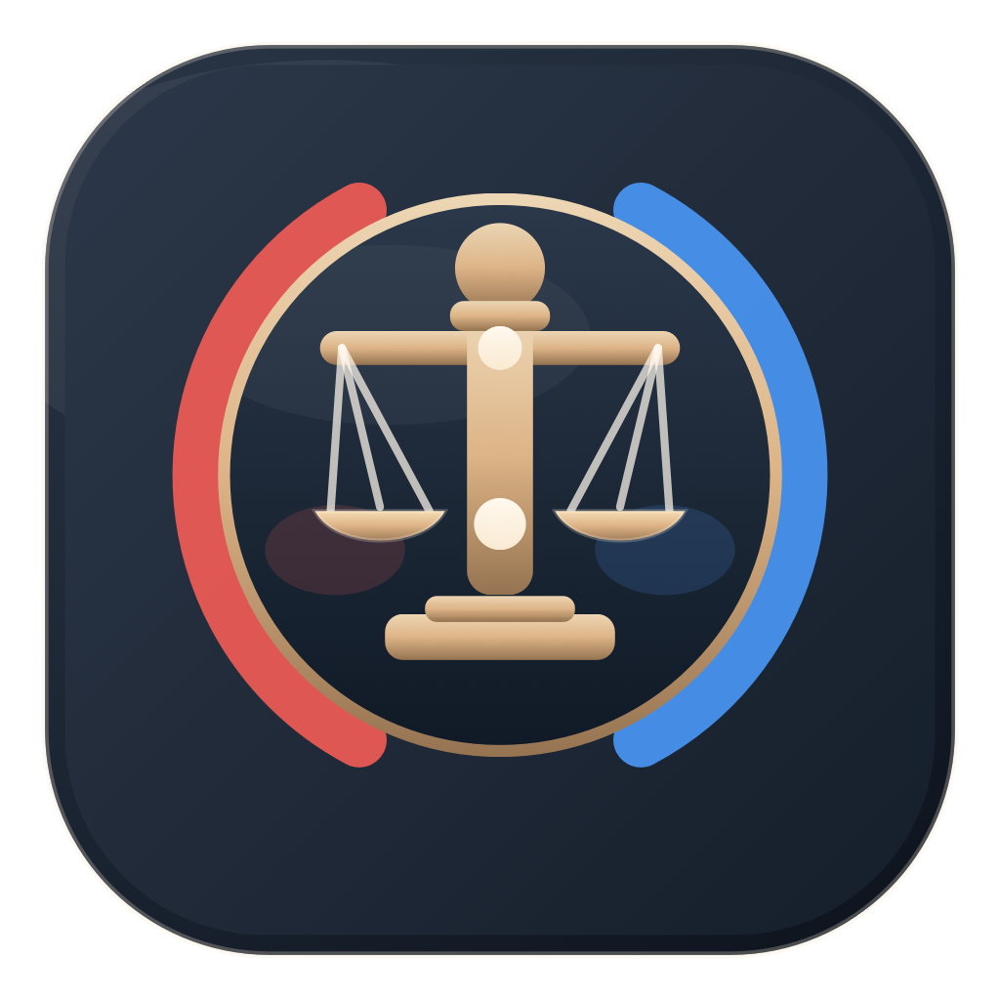

<p align="center">
  
</p>

<h1 align="center">Tribunal</h1>

<p align="center"><strong>Paste any claim. Watch it go to trial.</strong></p>

<p align="center">
  Tribunal is a macOS app for adversarial claim analysis. It doesn't just answer a prompt. It cross-examines it.
</p>

<p align="center">
  
  
  
  
</p>

## What It Is
Tribunal takes a claim, headline, post, or argument and runs it through a courtroom-style hearing.

Instead of producing a generic answer, it builds a structured adversarial analysis:
- `Prosecution` argues against the claim
- `Defense` argues for it
- `Evidence Gaps` identifies what is missing or unverifiable
- `Rhetorical Analysis` inspects persuasion tricks and logical weakness
- `Final Verdict` returns a judgment with confidence

It is not a fact-checker, not a chatbot, and not a summarizer.

It cross-examines.

## How It Works
1. Paste a claim, link, or block of text.
2. Click `Open Hearing`.
3. Watch the analysis stream in section by section.
4. Review the verdict and confidence level.
5. Revisit saved hearings in your case library.

## Hearing Structure
Every hearing is organized into the same trial-inspired flow:

- `Claim Summary` — what is actually being claimed
- `Prosecution` — the case against it
- `Defense` — the case for it
- `Evidence Gaps` — what is missing, uncertain, or unverifiable
- `Rhetorical Analysis` — fallacies, framing, and persuasion tactics
- `What Would Change the Verdict` — the evidence that could flip the outcome
- `Final Verdict` — `Supported`, `Partially Supported`, `Unsupported`, or `Disproven`

## Why It Feels Different
- Designed around adversarial reasoning instead of single-pass answering
- Streams the hearing live so the analysis feels procedural and legible
- Saves every case automatically for later reference
- Presents uncertainty explicitly instead of pretending to know more than it does
- Built as a native macOS app, not a web wrapper

## Requirements
- macOS 14 or later
- Swift 5.9+
- An OpenAI API key entered in Settings on first launch

## Build From Source
```bash
git clone https://github.com/Robert-Conover/tribunal.git
cd tribunal
swift build
swift run Tribunal
```

You can also open the package in Xcode and run the `Tribunal` target directly.

## Run Tests
```bash
swift test
```

## Current Status
Tribunal is already functional end to end:
- Paste input and open a hearing
- Stream structured analysis from the OpenAI API
- View verdicts with confidence scoring
- Copy or share hearing output
- Save and browse past cases in the sidebar
- Store API keys securely in Keychain
- Use dark mode, light mode, or system appearance

## Roadmap
- [x] Paste-and-analyze with streaming courtroom output
- [x] Auto-saved case library with sidebar navigation
- [x] Verdict with confidence scoring
- [x] Copy and share verdicts as formatted text
- [x] OpenAI API integration with model selection
- [x] Keychain-secured API key storage
- [x] Dark and light mode
- [ ] URL content extraction for pasted links
- [ ] Screenshot and image input via vision models
- [ ] Follow-up questions after a verdict
- [ ] Inline rhetoric and fallacy tagging
- [ ] Source quality grading
- [ ] Case search and filtering
- [ ] PDF and Markdown export
- [ ] Side-by-side claim comparison
- [ ] Claim tracking when new information emerges
- [ ] Multi-provider support
- [ ] Browser extension companion
- [ ] CloudKit sync across devices
- [ ] iPad and iPhone apps

## License
This project is not yet licensed. All rights reserved.
